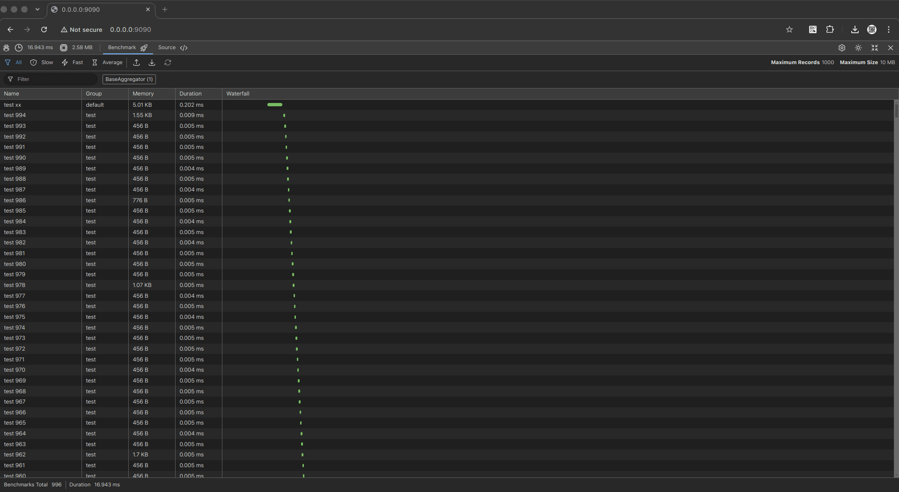
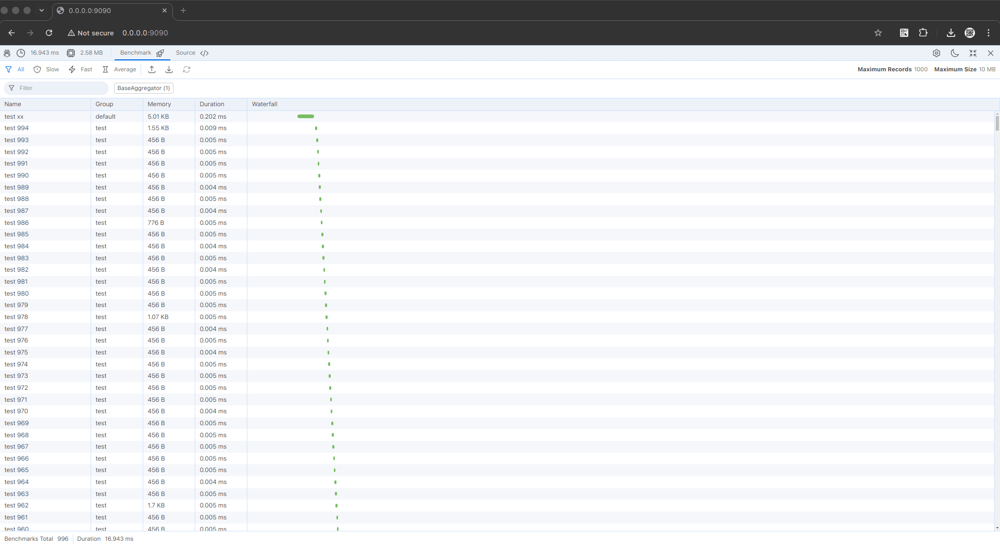

# PHP Profiler

[](https://github.com/ArrayIterator/php.profiler/actions/workflows/code-checking.yml)

## INSTALLATION

```bash
composer require arrayiterator/profiler
```
## PROFILING

```php
use ArrayIterator\Profiler\Profiler;

$profiler = new Profiler();
// start the profiler
$performance = $profiler->start('benchmark', 'Group Name', ['data' => 'information']);
try {
    // do something with the code
    // write the code that you want to benchmark
} finally {
    // best practice to stop the profiler using try -> finally
    // using finally to make sure the profiler is stopped
    $performance->stop(['additional' => 'information']);
    // or using profiler object
    // the group name is important when you have different group of benchmark
    // the group: default, as default group
    // the name of benchmark also important to identify the benchmark
    $profiler->stop('benchmark', 'Group Name', ['additional' => 'information']);
}


```
## RENDERING TOOLBAR

```php
/**
 * @var \ArrayIterator\Profiler\Profiler $profiler 
 */
$waterfall = $profiler->getWaterfall();

// render the toolbar
$darkMode = null; // set true if default dark mode or let it null when using autodetect
$content = $waterfall->renderJs($darkMode);

// can be echo or append to stream
// echo $content;
// append to stream interface (PSR-7)
// $response->getBody()->write($content);
```
## PREVIEW

[](images/preview-dark.png)
[](images/preview-light.png)

## ATTENTION

This package still under development, the profiler is ready but the UI is not yet ready. The UI is still under development.

But the profiler is ready to use, you can use it by installing the package and use the profiler.
You can customize the implementation of the Frontend or Backend.

## UI & IMPLEMENTATION OF RENDERER

Typescript & scss [**[assets](assets)**] is used to create the UI, the UI is created using the following technologies:

Maximum record size is 1000 records, if more than 1000 records, the UI will not render the benchmark.

### REQUIREMENT:
 
- PHP 7.4 or higher
- Composer
- DEV (Node.js (npm) - for installing the dependencies)

### TASKS

> BACKEND

- [x] Benchmark Profiler
- [x] Memory Profiler
- [x] Time Profiler
- [x] Render Profiler
- [x] Code Styling & PhpStan

> FRONTEND

- [x] ToolBar (Chrome Like)
- [x] Dark Mode & Light Mode (Auto Detect)
- [x] Resizeable
- [x] Responsiveness
- [x] Action Size
  - [x] Maximize
  - [x] Minimize (restore)
  - [x] Close
- [x] Benchmark Tab
  - [x] Filtering
  - [x] Waterfall Profiling
  - [x] Importer
  - [x] Exporter
  - [x] Restorer
  - [x] Message (information about the import, export, restore)
  - [x] Input Search
  - [x] Horizontal Resizable Section
- [ ] Labs Tab
- [x] Source Tab

#### Benchmark Tab

- [x] Filtering
  - [x] Importer
  - [x] Exporter
  - [x] Restorer
  - [x] Message (information about the import, export, restore)
  - [x] General Filter
  - [x] Performance Filter (Slow, Fast, Average)
  - [x] Search Filter (Follow the benchmark content)
  - [x] Aggregator Filter (Follow the benchmark aggregation)
- [x] Waterfall Profiling
  - [x] Using waterfall using div percentage
  - [ ] Add additional information for certain table
  - [ ] Clickable to show the detail of the benchmark

#### Labs Tab

- [ ] Profiler Information
  - [ ] Metadata of JSON
  - [ ] RAM Usage & Limit (chart using pie chart from highchart.js)
  - [ ] Additional Information
  - [ ] Chart for benchmark (multiple chart type)

#### Source Tab

- [x] Code Section
  - [x] Prettify/Minify the source code
  - [x] Download the source code
  - [x] Import the source code


## DEPENDENCIES

- Template Engine using [SquirrellyJS](https://squirrelly.js.org/)
- Chart using [HighChart](https://www.highcharts.com/)
- Icon & SVG using [HeroIcons](https://heroicons.com/)
- Compiled JS using [Webpack](https://webpack.js.org/) & [TypeScript](https://www.typescriptlang.org/)
- Compiled CSS using [Sass](https://sass-lang.com/)

## LICENSE

[MIT License](LICENSE)
